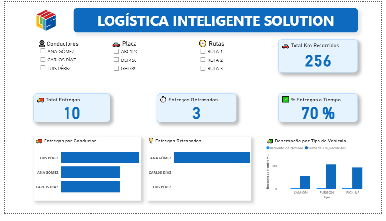
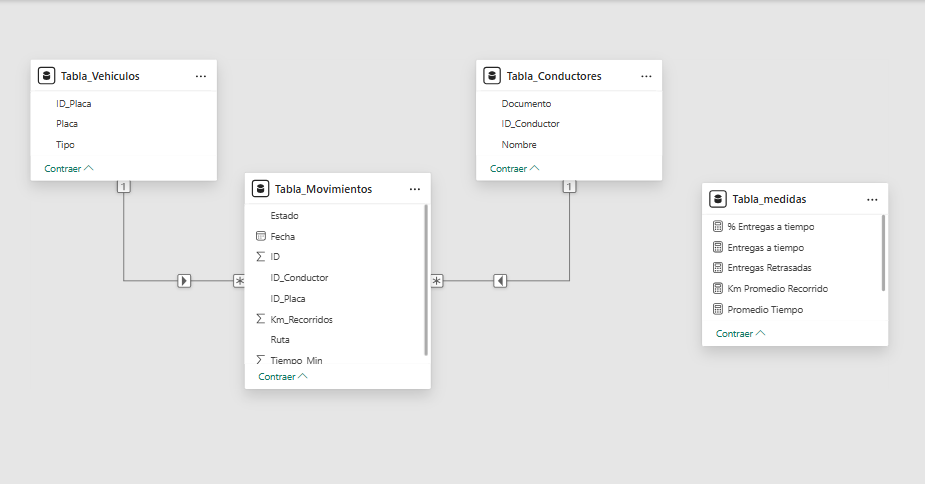

# Dashboard de Entregas – LOGÍSTICA INTELIGENTE SOLUTION

Este proyecto simula una solución de análisis de entregas para una empresa de logística, utilizando Power BI como herramienta principal de visualización. Los datos fueron preparados previamente en Excel y se utilizaron varias medidas DAX para construir un dashboard profesional e interactivo.

## 📚 Objetivo del Proyecto

Analizar el rendimiento de entregas por conductor, tipo de vehículo y ruta. Identificar entregas a tiempo, retrasadas, y el desempeño general de la flota en términos de kilometraje y tiempo promedio.

---

## 📁 Archivos del Proyecto

| ArchivoDescripción        |                                                                                            |
| ------------------------- | ------------------------------------------------------------------------------------------ |
| `Dashboard_Entregas.pbix` | Archivo principal de Power BI con el dashboard final.                                      |
| `Dashboard_Flota.xlsx`    | Archivo Excel con tres hojas: `Tabla_Conductores`, `Tabla_Movimientos`, `Tabla_Vehiculos`. |
| `ModeloER.PNG`            | Imagen del modelo entidad-relación usado en Power BI.                                      |
| `Dashboard.PNG`           | Imagen del dashboard final para portafolio.                                                |

---

## 🔄 Medidas DAX Utilizadas

### 1. **% Entregas a tiempo**

```
% Entregas a tiempo =
IF(
    ISBLANK(DIVIDE(
        CALCULATE(COUNTROWS(Tabla_Movimientos), Tabla_Movimientos[Estado] = "ENTREGADO"),
        COUNTROWS(Tabla_Movimientos)
    )),
    0,
    DIVIDE(
        CALCULATE(COUNTROWS(Tabla_Movimientos), Tabla_Movimientos[Estado] = "ENTREGADO"),
        COUNTROWS(Tabla_Movimientos)
    )
)
```

### 2. **Entregas a tiempo**

```
Entregas a tiempo =
CALCULATE(
    COUNTROWS(Tabla_Movimientos),
    Tabla_Movimientos[Estado] = "ENTREGADO"
)
```

### 3. **Entregas Retrasadas**

```
Entregas Retrasadas =
IF(
    ISBLANK(CALCULATE(COUNTROWS(Tabla_Movimientos), Tabla_Movimientos[Estado] = "RETRASADO")),
    0,
    CALCULATE(COUNTROWS(Tabla_Movimientos), Tabla_Movimientos[Estado] = "RETRASADO")
)
```

### 4. **Km Promedio Recorrido**

```
Km Promedio Recorrido = AVERAGE(Tabla_Movimientos[Km_Recorridos])
```

### 5. **Promedio Tiempo**

```
Promedio Tiempo = AVERAGE(Tabla_Movimientos[Tiempo_Min])
```

### 6. **Total Entregas**

```
Total Entregas =
IF(
    ISBLANK(COUNTROWS(Tabla_Movimientos)),
    0,
    COUNTROWS(Tabla_Movimientos)
)
```

### 7. **Total Km**

```
Total Km = SUM(Tabla_Movimientos[Km_Recorridos])
```

---

## 🌐 Visualizaciones Incluidas

- Tarjetas: Total Entregas, Entregas Retrasadas, Km Recorridos, % Entregas a Tiempo.
- Barras: Entregas por Conductor, Entregas Retrasadas.
- Gráfico combinado: Desempeño por tipo de vehículo (Recuento + Suma de Km).
- Segmentadores con íconos: Nombre, Placa, Ruta.
- Título y logos personalizados para presentación profesional.

---

## 📅 Fecha

Agosto 2025

---

## 🚀 Estado del Proyecto

Listo para presentación en portafolio. Publicado en Power BI Service y acompañado con imagen del dashboard para GitHub.

---

## 📄 Recomendaciones

- Este proyecto puede escalarse incluyendo tiempo de entrega prometido vs real.
- Se puede automatizar la carga con Python o SQL Server.
- Es ideal para roles de Analista de Datos o Reporting Analyst.

---





## 🔗 Link al Proyecto

[Ver en GitHub](https://github.com/agaviria-analytics/dashboard-entregas)

> Proyecto desarrollado por **Héctor Alejandro Gaviria Marín** | Portafolio Profesional
